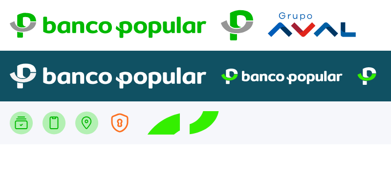

# Manual de marca aplicado — Garantías 360
## Banco Popular S.A. · Sistema visual para aplicaciones internas

| Campo | Valor |
|---|---|
| Versión | 0.2 — **Derivado, no oficial** |
| Fecha | 2026-09-25 |
| Fuentes | Páginas guardadas el 25/09/2026, con sus recursos (HTML, CSS y SVG): **Portal Bancario** (`mi.bancopopular.com.co/login`, v5.1.3) y página de producto **Cuenta Plateada** (`www.bancopopular.com.co`). |
| Hallazgo principal | El Portal está construido sobre el **sistema de diseño corporativo del Banco, "Designio"** (variables `--bpop-designio-*`). Este manual adopta sus tokens tal cual. |
| Archivos | [`tokens.css`](tokens.css) · [`tailwind-preset.ts`](tailwind-preset.ts) · activos en [`/public/marca`](../../public/marca) · [vista de activos](vista-activos.png) |

> ⚠️ **Alcance y validez.**
> - Este manual se reconstruyó del código de los sitios públicos del Banco y no reemplaza el manual de identidad oficial ni la documentación oficial de Designio (P-19).
> - Si el Banco tiene la librería Designio publicada (Figma, npm, Storybook), **se usa esa directamente** y este documento pasa a ser solo una guía de adaptación.
> - El uso de la marca en Garantías 360 debe estar autorizado por el Banco.
> - Convenciones de fuente:
>   - **[Designio]**: token del sistema de diseño del Banco.
>   - **[Portal]** y **[Público]**: valores observados en cada sitio.
>   - **[G360]**: adaptaciones propias para una aplicación empresarial densa, con WCAG 2.1 AA obligatorio.

---

## 1. Principios de la marca en Garantías 360

1. **Institucional y sobrio.** El verde petróleo es el color de la interfaz. El verde Popular vive en el logotipo y en los acentos de éxito. El naranja se reserva para enlaces y resaltados.
2. **Claridad operativa.** Inter en tamaños contenidos y densidad alta, como en el Portal.
3. **Cercanía en el tono.** El Banco tutea y habla en positivo. En Garantías 360 el tono es cercano pero preciso.
4. **Accesibilidad obligatoria.** Varios colores de marca no alcanzan el contraste mínimo como texto. Donde Designio ya trae un tono oscuro (`-900`), se usa ese; si no, se define una variante [G360].

---

## 2. Logotipo

| Pieza | Archivo en el repositorio | Colores | Uso en Garantías 360 |
|---|---|---|---|
| **Logotipo horizontal** (positivo) | `public/marca/logo-horizontal.svg` (201 × 32) | **Verde Popular `#00B800`** + gris `#969696` | Encabezado de la aplicación sobre fondo blanco. |
| **Logotipo horizontal negativo** | `public/marca/logo-horizontal-blanco.svg` (251 × 40); `logo-horizontal-blanco.png` | Blanco + `#F2F2F2` | Sobre verde petróleo: pantalla de ingreso, barra lateral expandida. |
| **Isotipo** (la "P") | `public/marca/isotipo.svg` (34 × 33) | `#00B800` + `#969696` | Favicon, barra lateral colapsada, cargadores. |
| **Isotipo blanco-verde** | `public/marca/isotipo-blanco-verde.png` | Blanco + verde | Isotipo sobre fondos oscuros. |
| Sello **Grupo Aval** | `public/marca/grupo-aval.png` | Colores del Grupo Aval | Solo en el pie de página y solo si la política corporativa lo exige. No es marca del Banco. |

> **Corrección frente a la v0.1:** el verde del logotipo es **`#00B800`**, no el petróleo. El archivo `Isotipo.svg` del Portal es el isotipo **del Banco**, aunque en el HTML aparezca con el texto alternativo "Grupo Aval".

**Anatomía:** isotipo "P" (trazo verde con lazo gris) + palabra *banco popular* en minúsculas, redondeada, en verde.

**Reglas (mientras llega el manual oficial) [G360]:**
- No deformar, recolorear, rotar ni aplicar efectos.
- Versión positiva solo sobre blanco o `#F6F7FB`; sobre petróleo o fondos oscuros, la versión negativa.
- El verde del logotipo (`#00B800`, 2,67:1 sobre blanco) **es de marca, no de texto**: nunca se usa como color de texto en la interfaz.
- **Área de protección:** como mínimo, la altura de la "P" del isotipo. **Tamaño mínimo:** 120 px de ancho para el horizontal y 24 px para el isotipo.
- Nombre del producto junto al logo: *Garantías 360* en Inter 600, color `dark-600`, separado por un divisor vertical de 1 px `light-600`.
- Pantalla de carga: el Portal usa un fondo de bienvenida verde `#009A3B` (`splash-mask.css`). En Garantías 360 se usa el petróleo, por consistencia con la interfaz **[G360]**.

---

## 3. Color — tokens Designio

### 3.1 Primario (petróleo) [Designio]
| Token | Hex | Uso |
|---|---|---|
| `primary-900` | `#0B3642` | Botón primario presionado; texto sobre fondos claros de marca |
| `primary-800` | `#1E3855` | Variante profunda |
| `primary-600` | **`#105163`** | **Color principal de la interfaz**: botones, barra lateral, encabezados, foco |
| `primary-400` | `#87A8B1` | Botón secundario presionado |
| `primary-100` | `#CFDCE0` | Hover secundario, selección |
| `primary-48 / 64 / 72 / 88` | `rgb(16 81 99 / .48 … .88)` | Capas y superposiciones |
| `primary-grad` | `linear-gradient(180deg, #26737F 0%, #105163 100%)` | Hover del botón primario, cabeceras |

### 3.2 Marca (verde Popular) [Designio + logotipo]
| Token | Hex | Uso |
|---|---|---|
| Verde logotipo | **`#00B800`** | Solo el logotipo e íconos de marca |
| `brand-400` | `#3AEF00` (formas decorativas `#34EF00`) | Formas gráficas y decoración de la pantalla de ingreso |
| `brand-600` | `#27C112` | Selección, interruptores, indicadores |
| `brand-900` | `#21A10F` | Acciones secundarias de texto grande, barras de desplazamiento |
| `brand-100` | `#D4F3D0` | Fondos de selección |
| `accent-grad` | `linear-gradient(180deg, #27C112 0%, #279F12 100%)` | Acentos |

### 3.3 Secundario (naranja) [Designio]
| Token | Hex | Uso |
|---|---|---|
| `secondary-900` | `#FE680D` | Enlaces e íconos de producto (en el Portal) |
| `secondary-600` / `-400` | `#F99B35` | Hover de enlaces |
| `secondary-100` | `#FEEBD7` | Fondos suaves |
| Naranja de íconos | `#FC7121` / `#FB7121` | Ícono de seguridad; degradados de tarjetas débito |

### 3.4 Terciario [Designio]
`terciary-900 #006863` · `terciary-600 #0CDDD9` · `terciary-400 #5DE8E6`. Uso puntual. En Garantías 360 se reserva para destacados informativos no semánticos **[G360]**.

### 3.5 Estados [Designio]
| Estado | `-100` fondo | `-400` | `-600` borde / ícono | `-900` **texto** | Contraste del `-900` sobre blanco |
|---|---|---|---|---|---|
| Éxito | `#D4ECD0` | `#93CF88` | `#279F12` | **`#1A6A0C`** | 6,75:1 ✅ |
| Advertencia | `#FEEBD7` | `#FCCD9A` | `#F99B35` | `#CF812C` → **usar `#8A4A00` [G360]** | 3,07:1 ❌ → 5,91:1 ✅ |
| Error | `#FED7D7` | `#FB787A` | `#F93538` | **`#A62325`** | 7,27:1 ✅ |
| Información | `#DBEAFD` | `#A5CAFA` | `#4B95F6` | **`#3263A4`** (`info-800 #3C54A1`) | 6,08:1 ✅ |

### 3.6 Neutros [Designio]
| Token | Hex | Uso |
|---|---|---|
| `dark-900` | `#000000` | Etiquetas de formulario (Portal) |
| `dark-600` | `#121212` | Títulos y texto principal |
| `dark-400` / `-100` | `#1F1F1F` / `#252525` | Superficies oscuras |
| `mid-900` | `#434343` | Texto de tablas |
| `mid-600` | `#555555` | Texto secundario |
| `mid-400` | `#7B7B7B` | Texto de apoyo (solo ≥ 14 px, 4,23:1) |
| `mid-100` | `#9D9D9D` | Íconos inactivos, placeholders decorativos |
| `light-900` | `#C6C6C6` | Bordes de entradas, deshabilitado |
| `light-600` | `#E4E4E4` | Divisores, bordes de tarjeta |
| `light-500` | `#C4C4C4` | Bordes secundarios |
| `light-400` | `#F5F5F5` | Encabezados de tabla, opción seleccionada |
| `light-100` | `#FFFFFF` | Tarjetas y superficies |
| Lienzo [Portal] | `#F6F7FB` | Fondo general de la aplicación |
| `carbon-48 … 88` | `rgb(18 18 18 / .48 … .88)` | Superposiciones de modal |

### 3.7 Reglas de contraste [G360]
| Color de marca | Contraste sobre blanco | Regla |
|---|---|---|
| `primary-600 #105163` | 8,83:1 | Libre (texto, fondos, bordes). |
| Verde logotipo `#00B800` | 2,67:1 | **Solo logotipo.** |
| `brand-600 #27C112` | 2,41:1 | Solo rellenos e íconos. |
| `secondary-900 #FE680D` | 2,92:1 | Solo íconos y bordes. **Enlaces y texto: `#B34808` (5,46:1) [G360].** |
| `error-600 #F93538` | 3,75:1 | Bordes e íconos; el texto va en `error-900`. |

El color nunca es el único portador de significado: todo estado lleva ícono y texto.

### 3.8 Proporción de uso
- **70 %** neutros;
- **20 %** petróleo;
- **5 %** naranja;
- **5 %** verde de marca y estados.

El verde vivo (`#3AEF00`) queda solo en ilustración y decoración, nunca en pantallas de trabajo.

---

## 4. Tipografía

| Ámbito | Familia | Fuente |
|---|---|---|
| **Designio / Portal (aplicaciones)** | **Inter** 400, 500, 600, 700 (`--bpop-designio-font-family: inter, sans-serif`), empaquetada como TTF en el Portal | [Designio] |
| Sitio comercial | *Core Sans* (Regular, Bold, Light, Thin), con Inter y Roboto de respaldo | [Público] |
| Íconos del Portal | fuente de íconos propia (`velocity-icons`) | [Portal] |

**Garantías 360 usa Inter**, igual que Designio. *Core Sans* es una fuente comercial con licencia del sitio de mercadeo y no se usa en la aplicación. En tablas se usa `font-variant-numeric: tabular-nums` **[G360]**.

**Escala tipográfica [Designio]** (tamaño / interlineado):

| Token | Tamaño | Interlineado | Uso en Garantías 360 |
|---|---|---|---|
| `he` | 88 px | 112 px | No se usa (piezas de mercadeo) |
| `h1` | 56 px | 64 px | No se usa en pantallas de trabajo |
| `h2` | 48 px | 56 px | — |
| `h3` | 32 px | 40 px | Cifra principal de un indicador (KPI) |
| `h4` | 28 px | 36 px | Título de la pantalla de ingreso |
| `h5` | 21 px | 28 px | **Título de página** |
| `s1` | 18 px | 24 px | **Título de sección** |
| `s2` | 16 px | 20 px | **Título de tarjeta, modal o panel** |
| `a1` | 15 px | 21 px | Texto destacado |
| `a2` / `b1` | 14 px | 20 / 24 px | **Texto general, celdas, botones** |
| `b2` | 13 px | 22 px | Texto secundario |
| `a3` / `b3` | 12 px | 17 / 20 px | **Etiquetas de formulario**, metadatos |
| `c` | 11 px | 16 px | Pie de página, notas |
| `o` | 10 px | 14 px | Sobre-títulos; mínimo absoluto |

Pesos [Designio]: regular 400, medium 500 (etiquetas), semibold 600 (énfasis y acciones de texto), bold 700 (botones y títulos). Espaciado entre letras: 0.

---

## 5. Espaciado, radios y elevación

**Espaciado [Designio]** (`--bpop-spacing-*`):

| Token | Valor |
|---|---|
| `xxxxxs` | 1 px |
| `xxxxs` | 2 px |
| `xxxs` | 4 px |
| `xxs` | 6 px |
| `xs` | 8 px |
| `2xs` | 10 px |
| `s` | 12 px |
| `sm` | 16 px |
| `2sm` | 20 px |
| `md` | 24 px |
| `lg` | 32 px |
| `2lg` | 34 px |
| `3lg` | 38 px |
| `xl` | 40 px |
| `xml` | 42 px |
| `2xl` | 48 px |
| `3xl` | 56 px |
| `4xl` | 64 px |
| `5xl` | 72 px |
| `6xl` | 80 px |

**Radios [Designio]:** `2` 2 px · `4` 4 px (chips) · `8` 8 px (**botones y entradas**) · `12` 12 px (**tarjetas**) · `16` 16 px (modales grandes) · `32` 32 px · `full` (píldoras). Borde estándar: `border-1` = 1 px.

**Sombras [Portal]:**
- Tarjeta: `0 2px 4px 0 rgba(35, 46, 36, 0.12)`.
- Elemento flotante: `0 6px 12px rgba(0, 0, 0, 0.15)`.
- Modal: `0 16px 24px 0 rgba(0, 0, 0, 0.14)`.

---

## 6. Componentes

### 6.1 Botones [Portal]
| Variante | Reposo | Hover | Presionado / cargando |
|---|---|---|---|
| **Primario** | `primary-600`, texto blanco | `primary-grad` | `primary-900` |
| **Secundario** | blanco, borde 1 px `primary-600`, texto `primary-600` | fondo `primary-100`, borde y texto `primary-900` | fondo `primary-400`, texto `primary-900` |
| **Deshabilitado** | `light-900`, texto blanco (exento de contraste WCAG; con *tooltip* que explique el bloqueo **[G360]**) | — | — |
| **Texto / enlace** | `#B34808` **[G360]** (Portal: `secondary-900`), 600, subrayado | `secondary-900` | — |
| **Peligro** **[G360]** | `error-900`, texto blanco | `#861C1E` | — |

- **Medidas:** alto 48 px (40 px en la variante compacta **[G360]**), padding 14 × 32 px, Inter 14 px bold, radio 8 px.
- **Foco visible:** `outline: 2px solid #105163; outline-offset: 2px; box-shadow: 0 0 0 3px rgba(16, 81, 99, 0.15)`.

### 6.2 Campos de formulario [Portal]
- **Entrada:** alto 48 px (40 px en compacto **[G360]**), padding 10 × 12 px, radio 8 px, borde `light-900`, cursor de texto `primary-600`, texto 14 px.
- **Etiqueta:** 12 px / medium, `dark-900`. Obligatorio: asterisco `error-600`.
- **Error:** borde `error-600`, fondo `error-100` al 32 %, mensaje en `error-900`.
- **Advertencia:** borde `warning-600`, fondo `warning-100` al 32 %.
- **Desplegable:** la opción seleccionada lleva fondo `light-400`, peso 600 y texto `success-900`.

### 6.3 Iconografía [Portal]
- **Íconos de línea** de trazo uniforme a 24 px. En los accesos rápidos van en verde `#00B800` dentro de un círculo `#B3F0B3`. El ícono de seguridad va en naranja `#FC7121`.
- **[G360]:** set de línea equivalente (*Lucide*, el de shadcn/ui), trazo 1,5–2 px, 16/20/24 px, coloreado con tokens de texto o de estado. El círculo verde claro solo se usa en accesos rápidos y estados vacíos.

### 6.4 Estructura de la aplicación [G360, sobre patrones del Portal]
- **Barra lateral:** fondo `primary-600`, logotipo negativo arriba, texto e íconos blancos (72 % de opacidad en reposo). El ítem activo lleva fondo `primary-900` e indicador izquierdo de 4 px en `brand-600` (el verde de marca).
- **Encabezado:** blanco, 64 px, borde inferior `light-600`, con logotipo positivo, nombre del producto, buscador global, notificaciones y usuario.
- **Migas de pan:** 12 px, `mid-600`; el nivel actual en `dark-600`.
- **Tarjetas:** blancas, radio 12 px, sombra de tarjeta, padding `md` (24 px).
- **Tarjetas de indicador (KPI):** etiqueta `a3`, cifra `h3` con números tabulares, variación con ícono y texto, y enlace "Ver cálculo".
- **Tablas:** encabezado `a3` 600 sobre `light-400`; filas de 44 px (32 px en modo denso); divisores `light-600`; hover `#F6F7FB`; selección `primary-100`; montos a la derecha.
- **Estados (badges):**

| Estado de la garantía | Fondo | Texto e ícono |
|---|---|---|
| Idónea / Activa / Perfeccionada | `success-100` | `success-900` |
| Condicionada / Por vencer / En estudio | `warning-100` | `#8A4A00` [G360] |
| No idónea / Vencida / Rechazada / Brecha crítica | `error-100` | `error-900` |
| En trámite / Informativo | `info-100` | `info-900` |
| Liberada / Cerrada / Anulada | `light-400` | `mid-600` |

- **Toasts:** radio 10 px, borde del color del estado, sombra flotante, abajo a la derecha, ancho máximo 390 px [Portal].
- **Modales y paneles laterales:** título `s2` / 600, radio 12–16 px, superposición `carbon-48`.

---

## 7. Visualización de datos [G360]

La marca aporta los colores; el método sigue la guía de visualización del proyecto. **Paleta categórica validada con el validador de paletas**: pasa las seis verificaciones en claro y en oscuro (banda de luminosidad, croma, daltonismo con ΔE ≥ 11,1, separación normal y contraste ≥ 3:1).

| Orden | Hex | Origen |
|---|---|---|
| 1 | `#00879B` | Petróleo Popular, aclarado para gráficas |
| 2 | `#E8620C` | Naranja Popular |
| 3 | `#5B6FD6` | Azul, cercano a `info` |
| 4 | `#8C6A00` | Ocre de apoyo |
| 5 | `#C2417A` | Magenta de apoyo |
| 6 | `#6E8B00` | Oliva de apoyo |

- **El verde de marca no se usa como serie**, porque está reservado para el estado "éxito" y confundiría. Tampoco se usa `#105163`: es demasiado oscuro y poco saturado para la banda de lectura de gráficas.
- **Reglas:**
  - Orden fijo, sin reciclar colores. Más de 6 series se agrupan en "Otros" o en gráficos pequeños.
  - El color sigue a la entidad (p. ej., "Hipoteca" siempre del mismo color).
  - Con 2 o más series siempre hay leyenda, más etiquetas directas si son 4 o menos.
- **Secuencial:** de `primary-100` a `primary-900`.
- **Divergente:** `#B34808` (bajo el objetivo) → `light-600` (en el objetivo) → `#00879B` (sobre el objetivo).
- **Estados en gráficas:** solo los de la sección 3.5, con ícono y etiqueta.

---

## 8. Imagen y tono

**Fotografía [Público] [Portal]:**
- Personas reales en situaciones cotidianas y positivas: parejas, adultos mayores, trabajadores.
- En el Portal aparecen como **fotografías recortadas sobre fondo** en los carruseles de ingreso, acompañadas de **formas orgánicas en verde vivo `#34EF00`** (`public/marca/formas/`).
- **En Garantías 360** la fotografía se limita a la pantalla de ingreso y a los estados vacíos. Las fotografías del Banco **no se copiaron al repositorio**: tienen derechos de imagen y hay que solicitarlas a Mercadeo.

**Voz y tono [Portal] [Público]:**
| Atributo | Así sí | Así no |
|---|---|---|
| Cercano (tú) | "Revisa los documentos pendientes de esta garantía." | "Se requiere que el usuario revise…" |
| Claro y directo | "No se puede liberar: tiene 2 obligaciones activas en Flexcube." | "Error 409: conflicto de estado." |
| Positivo, orientado a la acción | "Ayúdanos a completar el expediente" (Portal: "Ayúdanos a protegerte") | "Expediente inválido." |
| Preciso con cifras | "Cobertura 86,67 % — faltan $20.000.000 para el objetivo." | "Cobertura baja." |

- **Formatos:** `$ 1.234.567` (COP), `86,67 %`, `25/09/2026`, `11:50 a. m.` (formato del Portal).
- **Lema observado:** *"El banco para el mejor momento de la vida"* [Público]. No aplica dentro de Garantías 360.

---

## 9. Accesibilidad
- Foco visible con el estilo del Portal.
- El sitio público ofrece controles A−/A+ y alto contraste (`style-accesibilidad.css`). Garantías 360 soporta zoom del 200 % y el modo de alto contraste del sistema operativo.
- Contraste AA con los tonos `-900` de Designio o las variantes [G360] (sección 3.7).
- Navegación completa por teclado; ARIA en tablas, paneles y modales. Nunca solo color.

---

## 10. Pendientes
1. Confirmar con el Banco si **Designio** tiene una librería publicada (Figma, npm, Storybook) que Garantías 360 deba consumir directamente.
2. **Manual de identidad oficial**, versiones vectoriales maestras del logotipo y **autorización** de uso de la marca.
3. Validar con Mercadeo las adaptaciones **[G360]**: naranja de enlaces `#B34808`, texto de advertencia `#8A4A00` y paleta de gráficas.
4. Fotografías con licencia para la pantalla de ingreso y los estados vacíos.

---

## Control de cambios
| Versión | Cambio |
|---|---|
| 0.1 | Versión inicial a partir del HTML de las dos páginas (sin recursos). |
| 0.2 | Con los recursos de las páginas: **sistema de diseño Designio** adoptado (color, tipografía, espaciado, radios, degradados); **logotipo corregido** (verde `#00B800` + gris `#969696`; `Isotipo.svg` es del Banco); texto accesible con los tonos `-900` de Designio; paleta de gráficas revalidada sin el verde (reservado para estados); activos copiados a `public/marca`. |
